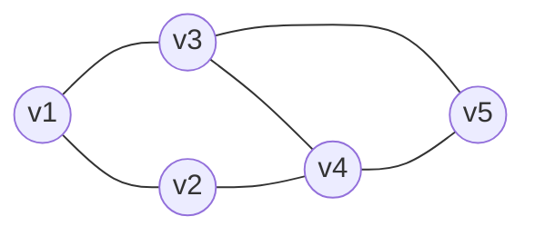

--nonLinear Data Structure
-----------------------------------------------------
  Graphs 
-----------------------------------------------------
   

 - Friendship Relatioship  
 - random connection amongst the nodes 
 - represented as pair of sets G=(V,E)

      Eg;

       1. vertices V = {v1,v2,v3,v4,v5}
       2. edges    E = {(v1,v2),(v1,v3),(v2,v4)
                        (v3,v4),(v3,v5),(v4,v5)}

                  

|                |Directed                          |Undirected graphs                         |
|----------------|-------------------------------|-----------------------------|
|1|`edges have directions |* Eg: social network if v1 is friend of v2 it means v2 is also friend of v1.                  |
|2          |`orederd pair (v1,v2) `            |"Eg: webpage have v1link to v2, crawler also use this" 
|3          |`--`|-- is en-dash

